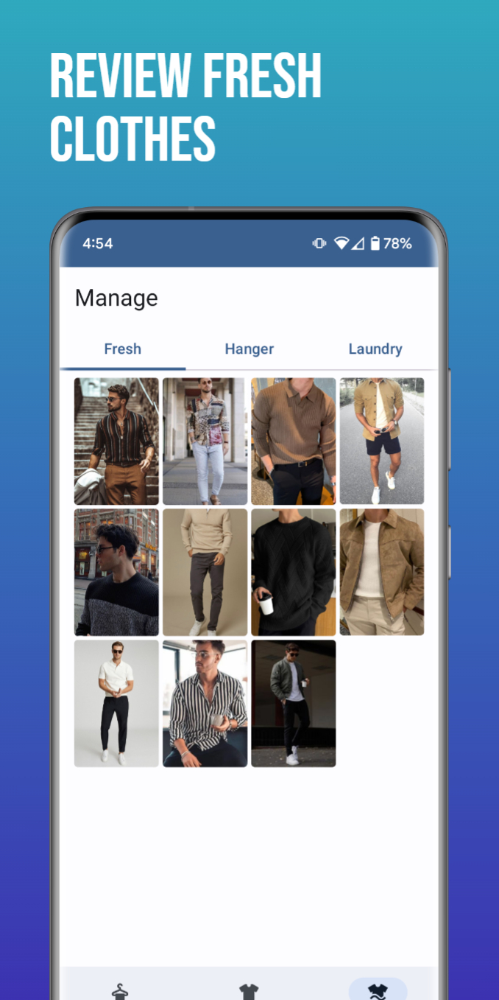

# Drape - The Ultimate Clothing Organization App

<div align="center">
  
</div>

Drape is the ultimate clothing organization app developed using **Android Jetpack Compose**. It revolutionizes the way you manage your wardrobe by providing a virtual closet that allows you to efficiently store and track all your clothes without the need for cloud storage. With its user-friendly interface and intuitive features, managing your outfits has never been easier.

## Download

Drape is available for download on the [Google Play Store](https://play.google.com/store/apps/details?id=com.ajitesh.drape&hl=en-IN).

## Features

- **Virtual Closet:** Organize and manage your clothing items in a virtual closet, making it easy to keep track of your wardrobe.

- **Local Storage:** Drape uses a Room database to securely store your clothing data, ensuring your privacy and data security.

- **Camera Integration:** Seamlessly add photos of your clothing items using the camera feature, making it convenient to visually catalog your wardrobe.

- **Intuitive Interface:** Drape offers a user-friendly and intuitive interface, making it simple to add, edit, and categorize your clothes.

## Getting Started

Follow these steps to get started with Drape:

1. Clone this repository to your local machine using:
   ```
   git clone https://github.com/sakarayajitesh/Drape-Android.git
   ```

2. Open the project in Android Studio.
3. Build and run the app on your device or emulator.

## Screenshots

<p float="left">

&nbsp;&nbsp;&nbsp;&nbsp;&nbsp;

&nbsp;&nbsp;&nbsp;&nbsp;&nbsp;

&nbsp;&nbsp;&nbsp;&nbsp;&nbsp;

&nbsp;&nbsp;&nbsp;&nbsp;&nbsp;

</p>

## Contributing

Contributions are welcome! If you find any issues or want to contribute enhancements to Drape, feel free to open a pull request. Make sure to follow the [contributing guidelines](CONTRIBUTING.md) in this repository.

## License

This project is licensed under the [MIT License](LICENSE).

---

Feel free to reach out to me at sakarayajitesh@gmail.com for any inquiries or support.


